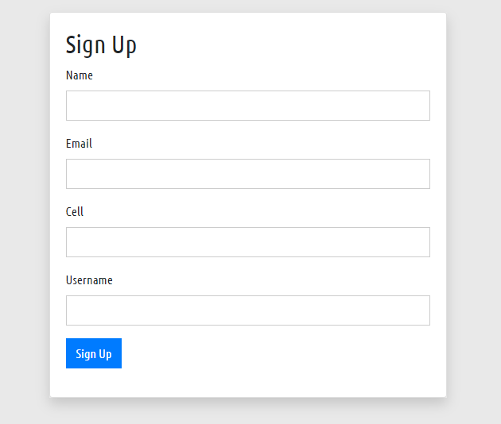

## Form validation System
This is a form validation system project. We will upload all resource here step by step.



#### Our project features 
- Form fields value check 
- Email check 
- Cell check 
- Username check 
- Special email check 
- etc 


```php

/**
 * Form isseting 
 */
if (isset($_POST['add'])) {
    // get form values 
    $name = $_POST['name'];
    $email = $_POST['email'];
    $cell = $_POST['cell'];
    $uname = $_POST['uname'];


    $msg = '';
    // form validation
    if (empty($name) || empty($email) || empty($cell) || empty($uname)) {
        $msg =  "<p class=\" alert alert-danger \">All fields are required ! <button class=\"close\" data-dismiss=\"alert\" >&times;</button></p>";
    } else {
        $msg =  "<p class=\" alert alert-success \">Data table! <button class=\"close\" data-dismiss=\"alert\" >&times;</button></p>";
    }
}

```

